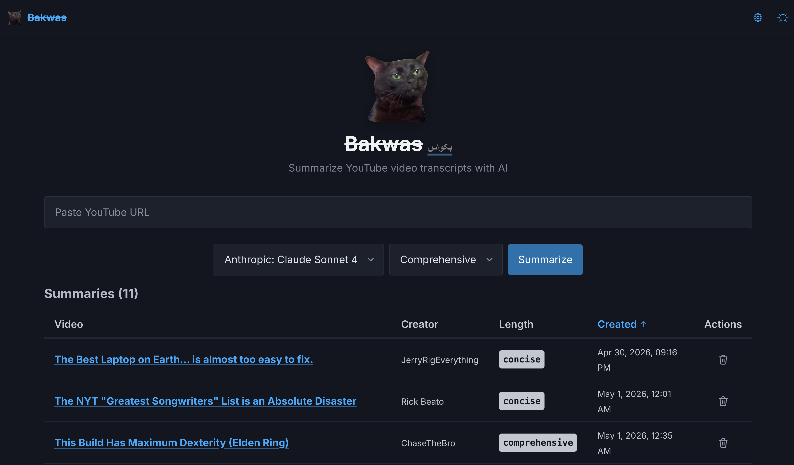

# Bakwas

Skip the bakwas ("nonsense") — extract and summarize YouTube video transcripts with the LLM of your choice.

<p align="center">
  
</p>

Bakwas is a small, self-hosted Flask app that pulls captions from a YouTube video, sends them through the LLM provider you configure (Anthropic, OpenAI, Google, DeepSeek, Groq, OpenRouter, a local Ollama, or any OpenAI-compatible endpoint), and stores the summary in a local SQLite database so you can revisit it later.

## Features

- Works with any LLM via a pluggable provider registry — OpenAI-compatible endpoints are fully supported
- Concise (bulleted) or comprehensive (paragraph) summary styles
- Server-side sorting, pagination, and URL-based caching so you don't pay to regenerate the same summary twice
- Settings modal for default model, default summary style, and items-per-page preferences
- Dark and light themes
- Rate limiting on the expensive endpoint only, disabled automatically in local dev
- Ships as a single Docker container with a SQLite volume

## Quick start

```bash
git clone https://github.com/alifbae/bakwas.git
cd bakwas

cp .env.example .env
# Set at least ANTHROPIC_API_KEY (or another provider key)

docker-compose up -d
```

Bakwas is now available at [http://localhost:5000](http://localhost:5000).

## Full documentation

Comprehensive docs are at **[bakwas.alifbae.dev/docs](https://bakwas.alifbae.dev/docs)**, including:

- [Getting started with Docker](https://bakwas.alifbae.dev/docs/getting-started/docker/)
- [Local development setup](https://bakwas.alifbae.dev/docs/getting-started/local/)
- [Environment variables](https://bakwas.alifbae.dev/docs/configuration/env/)
- [Provider configuration](https://bakwas.alifbae.dev/docs/configuration/providers/)
- [Rate limiting](https://bakwas.alifbae.dev/docs/configuration/rate-limiting/)
- [Reverse proxy setup](https://bakwas.alifbae.dev/docs/operations/reverse-proxy/)
- [Troubleshooting](https://bakwas.alifbae.dev/docs/operations/troubleshooting/)

The docs source lives in [`docs/content/`](docs/content/).

## License

MIT — see [LICENSE](LICENSE).

## Disclaimer

AI-generated summaries may contain inaccuracies. Always verify important information against the original video.
